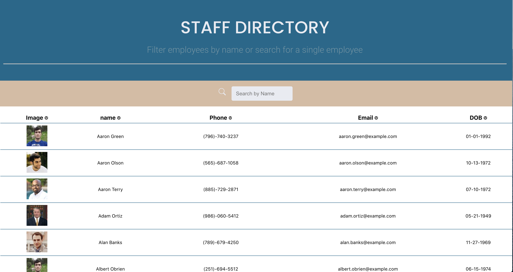

#Staff Directory

## Table of Contents
[Description](#description) 
[Dependencies](#dependencies) 
[Authors](#authors)   
[Future Development](#development)  
[Links](#links) 

## Description
This app creates a simple directory using React. It allows the user to search and filter based on the contact's name. The search field updates in real time based on the user input.

## Dependencies
This app uses react, react-icons, axios and the randomuser.me api to generate test data.

## Authors
Kimberly Owens

## Development
Future development could add the functionality to filter and search on multiple fields.
## Links
[Staff Directory](https://cryptic-badlands-67351.herokuapp.com/)
